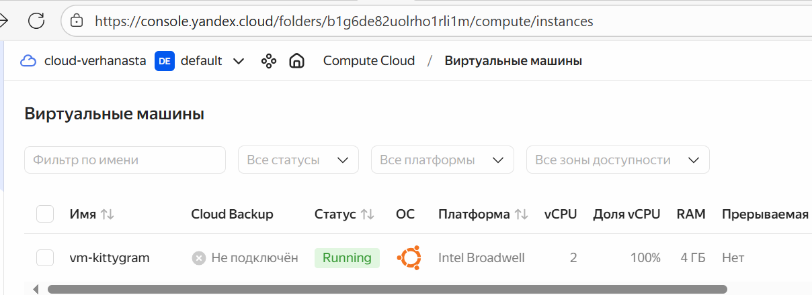
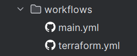
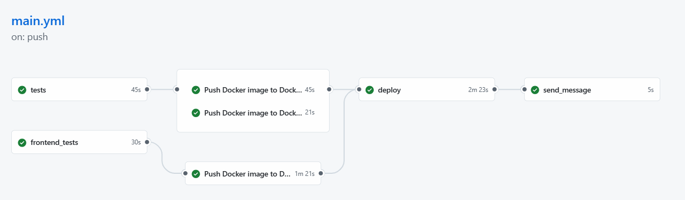
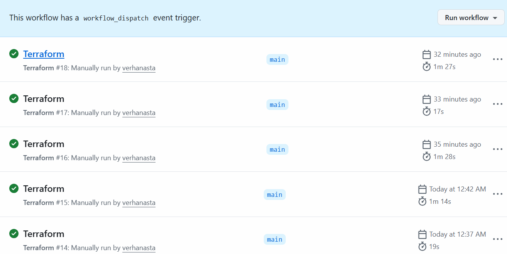
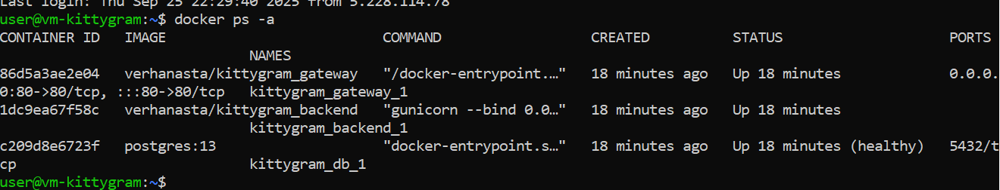
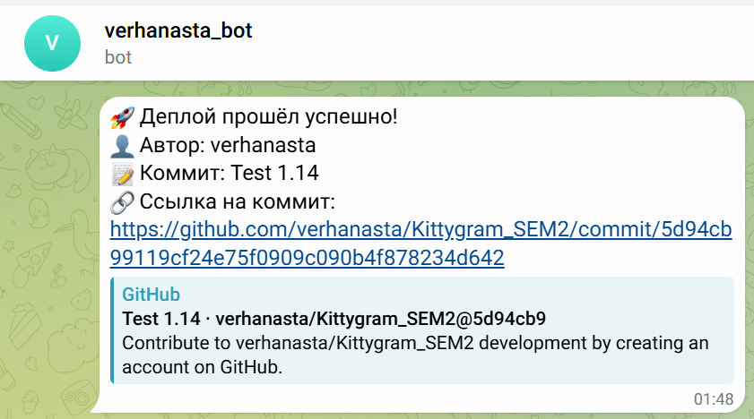

#  Kittygram🐈‍: возвращение легендарного проекта. Создание виртуальной инфраструктуры для Kittygram
## Задачи:
- Создать виртуальную инфраструктуру


- В репозиторий добавлен workflow для развёртывания инфраструктуры с помощью Terraform.



- Проект Kittygram доступен по ссылке, указанной в tests.yml.


- Стадия автотестов после деплоя также выполняется успешно.


- Функциональность проекта Kittygram соответствует описанию.



- Проверка жизнеспособности бэка после проведённых манипуляций:


- Отправка сообщения в бота



## Структура проекта

```
kittygram-final
├── .github/workflows/         # CI/CD
│       ├── terraform.yml      # Файл с воркфлоу для развёртывания инфраструктуры
│       └── deploy.yml         # Файл с воркфлоу для деплоя приложения
├── backend/                   # Django
├── frontend/                  # React
├── nginx/                     # Nginx
├── infra/                     # Файлы Terraform, описывающие инфраструктуру
├── tests.yml                  # Файл с данными для проверки
└── docker-compose.production.yml
```
## Развёртывание в Yandex.Cloud

1. Инициализация через Terraform:
```bash
cd infra/
terraform init
```
2. Применить конфигурацию:
```bash
terraform apply -auto-approve
```
После завершения работы Terraform выдаст адрес и название ВМ.

## URL Kittygram:
- Вебморда: `http://89.169.148.232/`
- Админпанель Django: `http://89.169.148.232/admin/`